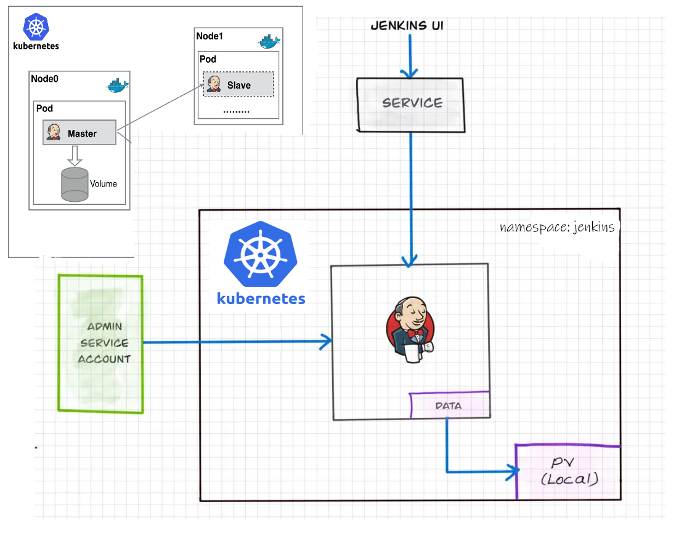
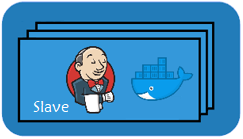
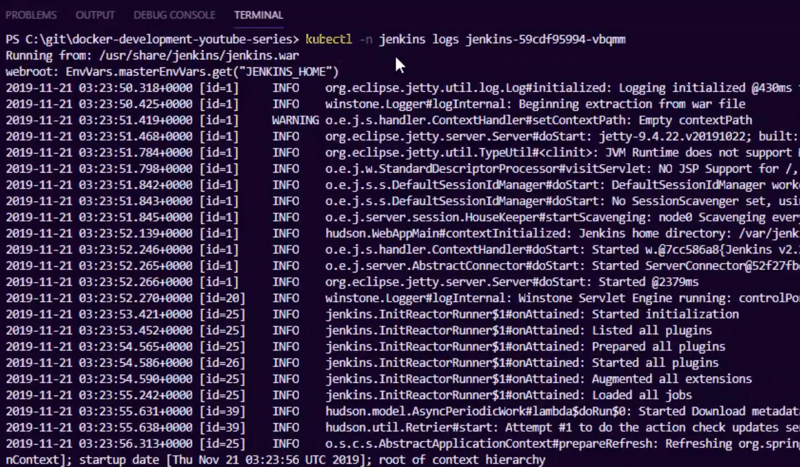
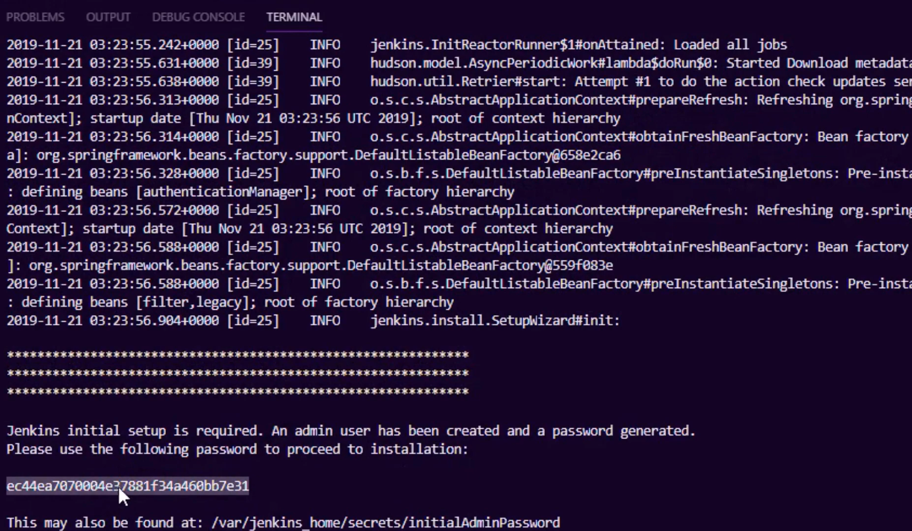
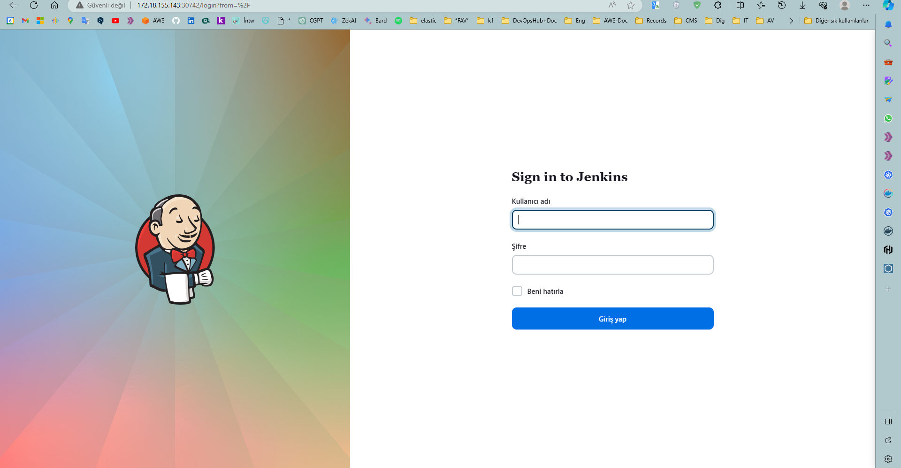
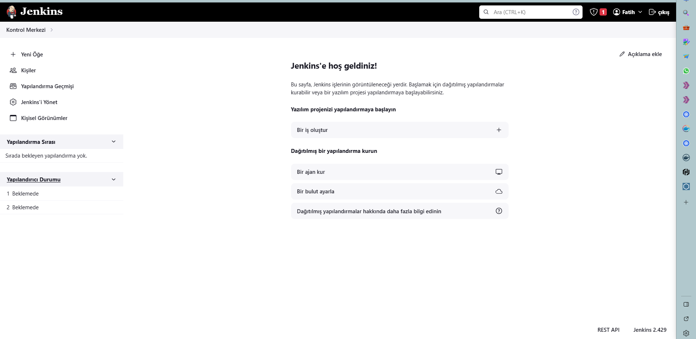

Bu README dosyası, Multipass kullanarak Ubuntu sanal makineler üzerine Kubernetes kümesini ve Jenkins aracını nasıl dağıtacağınızı adım adım açıklar.




---

# Ubuntu Sanal Makinelerin Üzerine Kubernetes Kümesi Kurulumu ve Cluster'a Jenkins Kurulumu



Bu README belgesi, Multipass ile Ubuntu sanal makineler üzerine Kubernetes kümesi kurulumunu ve Jenkins aracını nasıl dağıtacağınızı adım adım açıklar. Aşağıdaki adımları takip ederek, bir Kubernetes kümesi oluşturabilir ve Jenkins'i bu kümeste dağıtarak CI/CD süreçlerini yönetebilirsiniz.

## Gereksinimler

- Multipass'ı [buradan](https://multipass.run/) indirin ve yükleyin.

## Adım 1: Master ve Worker Sanal Makineler Oluşturmak

1. Bir Master düğümü oluşturmak için aşağıdaki komutu kullanın. Ayrıca Worker düğümleri eklemek isterseniz, bu adımı tekrarlayın.

```bash
multipass launch --name master --cpus 2 --mem 2G --disk 10G
multipass launch --name worker --cpus 2 --mem 2G --disk 10G
```

2. Master düğümüne SSH erişimi sağlamak için aşağıdaki komutu kullanın:

```bash
multipass shell master
```

## Adım 2: Kubernetes Kümesini Kurmak

1. Master düğümünde Kubernetes kümesini kurmak için aşağıdaki komutları sırayla çalıştırın:

```bash
# Kubernetes'ı yüklemek için kubectl kullanın
sudo snap install kubectl --classic

# Kubernetes kurulum dosyalarını alın
sudo kubeadm init --pod-network-cidr=10.244.0.0/16

# Yüklenen Kubernetes konfigürasyonunu kullanmak için aşağıdaki komutu çalıştırın
mkdir -p $HOME/.kube
sudo cp -i /etc/kubernetes/admin.conf $HOME/.kube/config
sudo chown $(id -u):$(id -g) $HOME/.kube/config

# CNI ağı kurmak için aşağıdaki komutu çalıştırın (örneğin, Calico)
kubectl apply -f https://docs.projectcalico.org/manifests/calico.yaml
```

2. Kubernetes kümenizin başarılı bir şekilde kurulduğunu doğrulamak için aşağıdaki komutu kullanın:

```bash
kubectl get nodes
```

## Adım 3: Jenkins'i Kubernetes Kümeste Dağıtmak

1. Jenkins'i Kubernetes kümeste dağıtmak için aşağıdaki YAML dosyasını kullanabilirsiniz. Örneğin, `jenkins-deployment.yaml` adıyla bir dosya oluşturun ve içeriği aşağıdaki gibi yapıştırın:

```yaml
apiVersion: apps/v1
kind: Deployment
metadata:
  name: jenkins
  labels:
    app: jenkins
spec:
  selector:
    matchLabels:
      app: jenkins
  replicas: 1
  strategy:
    type: RollingUpdate
    rollingUpdate:
      maxSurge: 1
      maxUnavailable: 0
  template:
    metadata:
      labels:
        app: jenkins
    spec:
      serviceAccountName: jenkins
      containers:
      - name: jenkins
        image: jenkins/jenkins:latest
        imagePullPolicy: Always
        env:
        - name: JAVA_OPTS
          value: -Xmx2048m -Dhudson.slaves.NodeProvisioner.MARGIN=50 -Dhudson.slaves.NodeProvisioner.MARGIN0=0.85
        ports:
        - containerPort: 8080
          protocol: TCP
        - containerPort: 50000
          protocol: TCP
        volumeMounts:
        - mountPath: /var/jenkins_home
          name: jenkins
      restartPolicy: Always
      securityContext:
        runAsUser: 0
      terminationGracePeriodSeconds: 30
      volumes:
      - name: jenkins
        persistentVolumeClaim:
          claimName: jenkins-claim
---
apiVersion: v1
kind: Service
metadata:
  name: jenkins
  labels:
    app: jenkins
spec:
  type: NodePort
  ports:
    - name: ui
      port: 8080
      targetPort: 8080
      protocol: TCP
    - name: slave
      port: 50000
      protocol: TCP
    - name: http
      port: 80
      targetPort: 8080
  selector:
    app: jenkins
```

`Note:Jenkins'i Kubernetes kümeste dağıtmak için örnek olarak deployment ve service objesi yukarıda verildi. Diğer objelerin yaml dosyalarını repodan alabilirsiniz.`

#### Kısa Ymal dosyalarının objelerin açıklaması:

`"jenkins-pv.yaml" ve "jenkins-pvc.yaml" dosyaları, Jenkins uygulamanızın verilerini saklamak için gereklidir. "jenkins-pv.yaml", Jenkins uygulamanızın verilerini saklamak için bir kalıcı depolama alanı oluşturur. Bu depolama alanı, Kubernetes kümenizdeki bir fiziksel disk veya bulut depolama hizmeti tarafından sağlanabilir. "jenkins-pvc.yaml", Jenkins uygulamanızın bu depolama alanına erişmesine izin veren bir kalıcı depolama talebi oluşturur.`

``Son olarak, "jenkins-rbac.yaml" dosyası, Jenkins uygulamanızın Kubernetes kümenizdeki diğer kaynaklara erişmesine izin veren rol tabanlı erişim kontrolü (RBAC) kurallarını tanımlar. Bu dosya, Jenkins uygulamanızın Kubernetes kümenizdeki diğer kaynaklara erişmesine izin vermek için gereklidir.``

Kubernetes’te Rol Tabanlı Erişim Kontrolü (RBAC), kullanıcıların ve servis hesaplarının Kubernetes kaynaklarına erişimini yönetmek için kullanılan bir mekanizmadır. RBAC, Kubernetes kümenizdeki kaynaklara erişim sağlamak için roller ve bu rolleri özneler ile bağlama işlemidir. Özneler, servis hesapları veya gruplar gibi kimlik doğrulaması yapılmış kullanıcılardır.

jenkins-rbac.yaml dosyası, Jenkins uygulamanızın Kubernetes kümenizdeki diğer kaynaklara erişmesine izin veren RBAC kurallarını tanımlar. Bu dosya, aşağıdaki özelliklere sahiptir:

ServiceAccount türünde bir özne vardır ve bu özne, Jenkins uygulamanızın Kubernetes kümenizdeki diğer kaynaklara erişmesine izin vermek için kullanılır.
ClusterRole türünde bir rol referansı vardır ve bu rol, Jenkins uygulamanızın Kubernetes kümenizdeki diğer kaynaklara erişmesine izin vermek için kullanılır. Bu ClusterRole, aşağıdaki kaynaklara erişim sağlar:

* pods: Pod’ları yönetmek için
* pods/exec: Pod’ların içindeki konteynerlarda komut çalıştırmak 
için.

* pods/log: Pod’ların günlüklerine erişmek için.

* secrets: Secret’ları yönetmek için.

* configmaps: ConfigMap’leri yönetmek için.

* deployments: Deployment’ları yönetmek için.

* services: Service’leri yönetmek için.

* ingresses: Ingress’leri yönetmek için.``

RoleBinding türünde bir nesne vardır ve bu nesne, Jenkins uygulamanızın Kubernetes kümenizdeki diğer kaynaklara erişmesine izin vermek için kullanılır. Bu RoleBinding, aşağıdaki özelliklere sahiptir: ``ClusterRole türünde bir rol referansı vardır ve bu rol, yukarıda oluşturulan ClusterRole’dur.`` ServiceAccount türünde bir özne vardır ve bu özne, yukarıda oluşturulan ServiceAccount’dur.


2. Jenkins Deployment'ını clusterda uygulamak için aşağıdaki komutu kullanın:

* önce `jenkins` adında bir namespace oluşturacağız.

```bash
kubectl create ns jenkins
```

3. Jenkins objelerini çalıştırıp uygulama için yaml dosyalarının olduğu dizinde aşağıdaki komutu kullanın:

```bash
kubectl apply -n jenkins -f .
```

`Pod objesi oluştuktan sonra jenkins arayüzüne ilk defa bağlanma için başlangıç passwordu oluşacaktır bunu podun loglarından alabiliriz.`
 initialadminpassword

```bash
kubectl logs -n jenkins jenkins-xxxxxxxx-xxxxx
```






4. Jenkins'in tüm objelerinin oluşup oluşmadığına ve services objesinden port numarası almak için aşağıdaki komutu kullanın:

```bash
kubectl get all -n jenkins
```

5. Web tarayıcınızı kullanarak Jenkins'e worker makinenin nodun ip adresi ve port numarasından ``[worker_ip:node_port]`` erişebilirsiniz.

Bu adımları takip ederek, Multipass ile Ubuntu sanal makineler üzerinde Kubernetes kümesini ve Jenkins aracını kurabilirsiniz.







---
